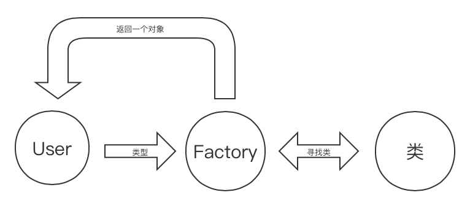
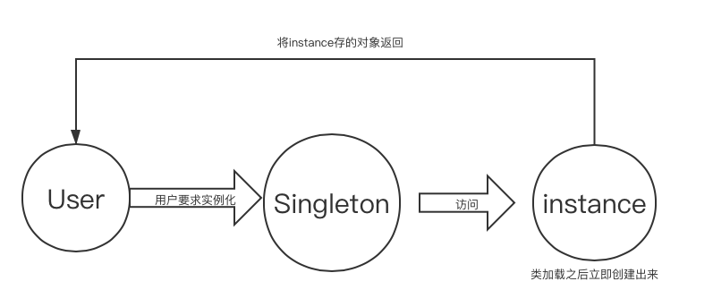
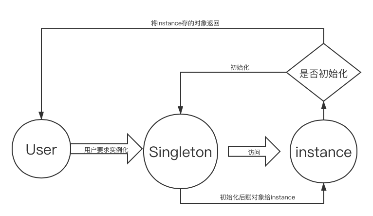

# 设计模式

[toc]

# 创建型模式

- 帮助系统独立于创建、组合和表示对象
- 类创建型模式
  - 使用**继承**改变被实例化的类
- 对象创建型模式
  - 将实例化委托给另一个对象

## 简单工厂模式

- 优点
    - **工厂类含有必要的判断逻辑**，可以决定在什么时候创建哪一个产品类的实例，客户端可以免除直接创建产品对象的责任，而仅仅“消费”产品；
    - 简单工厂模式通过这种做法实现了对责任的分割，它**提供了专门的工厂类用于创建对象**。
    - 客户端无须知道所创建的具体产品类的类名，只需要知道具体产品类所对应的参数即可，对于一些复杂的类名，通过**简单工厂模式可以减少使用者的记忆量**。
    - 通过引入配置文件，可以在不修改任何客户端代码的情况下更换和增加新的具体产品类，在一定程度上提高了系统的灵活性。
- 缺点
    - 由于工厂类集中了所有产品创建逻辑，**一旦不能正常工作，整个系统都要受到影响**。
    - 使用简单工厂模式将**会增加系统中类的个数**，在一定程序上增加了系统的复杂度和理解难度。
    - 系统扩展困难，一旦添加新产品就不得不修改工厂逻辑，同样破坏了“开闭原则”；在产品类型较多时，有可能造成工厂逻辑过于复杂，不利于系统的扩展和维护。
    - 简单工厂模式由于使用了静态工厂方法，造成工厂角色无法形成基于继承的等级结构。

## 单例模式

- 单例模式为了**避免出现不一致状态**
  - *所以,每台计算机可以有若干个打印机，但只能有一个后台打印程序，以避免两个打印作业同时输出到打印机中。每台计算机可以有若干通信端口，系统应当集中管理这些通信端口，以避免一个通信端口同时被两个请求同时调用。*
- 单例模式**只能有一个实例**。
  - **提供一个访问它的全局访问点**
- 单例类必须创建自己的唯一实例。
- 单例类必须向其他对象提供这一实例。

### 饿汉式单例模式

---

- 方法
  - Private Singleton()
    - private只能是内部初始化 防止外部初始化
  - 新建一个private static 的 Singleton变量 instance = new Singleton()
    - 局部静态变量 初始生成一次后不能再初始化
      - 只能初始化一次
    - 所有返回的对象是同一个对象
- 弊端
  - 相对占用内存

### 懒汉式单例模式

---

